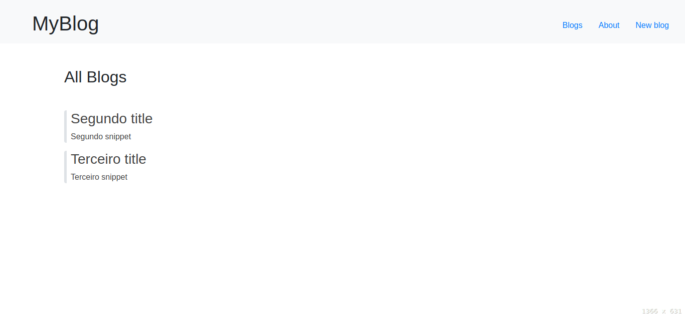
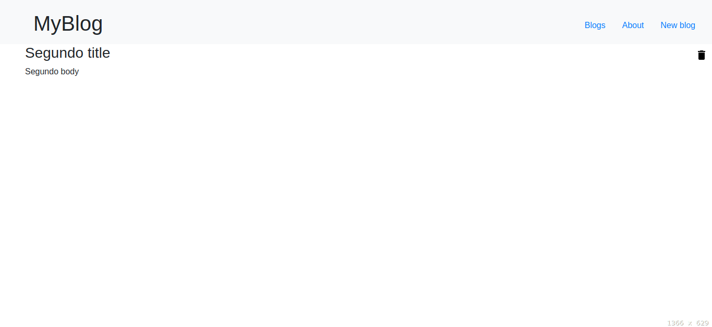
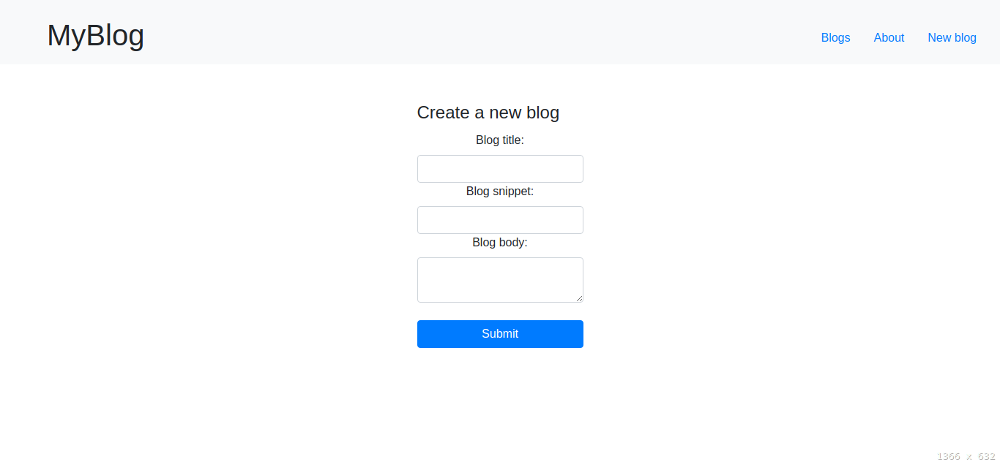

<h1 align="center"> node-mini-blog </h1>

<p align="center">
  <a href="https://github.com/ErickLuizA/node-mini-blog/graphs/commit-activity" alt="Maintenance">
    
  </a>

  <a href="./LICENSE" alt="License: MIT">
    
  </a>

<br/>


<a href="https://github.com/ErickLuizA/node-mini-blog/stargazers">
  
</a>

<p align="center">
  <a href="#clipboard-description">Description</a>&nbsp;&nbsp;&nbsp;|&nbsp;&nbsp;&nbsp;
  <a href="#building_construction-technologies">Technologies</a>&nbsp;&nbsp;&nbsp;|&nbsp;&nbsp;&nbsp;
  <a href="#rocket-getting-started">Getting Started</a>&nbsp;&nbsp;&nbsp;|&nbsp;&nbsp;&nbsp;
  <a href="#memo-license">License</a>&nbsp;&nbsp;&nbsp;|&nbsp;&nbsp;&nbsp;
  <a href="#framed_picture-screenshots">Screenshots</a>
</p>

## :clipboard: Description

A node-mini-blog made with nodejs

## :building_construction: Technologies

- [Node.js](https://nodejs.org/en/)
  - [Express](https://expressjs.com)
  - [Ejs](https://ejs.co/)
  - [sqlite3](https://www.sqlite.org/index.html)
  - [nodemon](https://www.npmjs.com/package/nodemon)

## :rocket: Getting Started

## 1. Download the repository

```shell
 $ git clone https://github.com/ErickLuizA/node-mini-blog.git
```

## 2. Installation

```shell
# Go into the repository
$ cd node-mini-blog

# Install dependencies
$ npm install
```

## 3. Execution

```shell
# On the root folder
$ npm run dev
```

## :framed_picture: Screenshots

<div>
  
  
  
</div>

## :memo: License

This project is under the MIT license. See the file [LICENSE](LICENSE) for more details.

---

Build with 💙 By [Erick](https://www.linkedin.com/in/erick-luiz-47151a1a4/)
